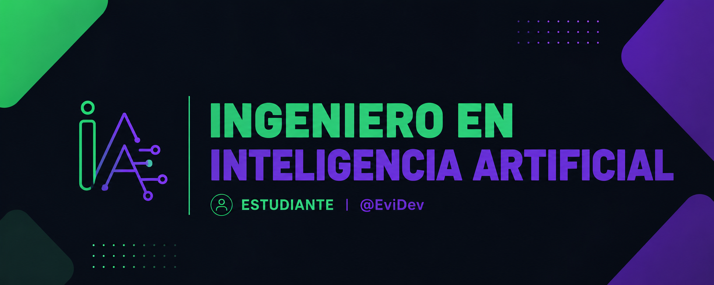

## Hola, soy 🎧EviDev🎧 

---

## 🎮 Descripcion 🎮
Estudiante apasionado por AI Classical Planning 📡 y los modelos supervisados, estudiando los modelos no supervisados y por refuerzo. Una parte en la que me encanta enfocarme es a la IA aplicada en sistemas empotrados y ubicuos 🤖⚡. Con poca experiencia en programacion de base de datos. Ultimamtente me llama mucho la atencion los automatas que funcionan con Vision Artificial.

---

## ☁️ Softwares Utilizados ☁️
- Arduino-ide 🪛
- DesignSpark ⚡

---

 ## 📟 Lenguajes Utilizados 📟
 - C++
 - Python
 - C

  ## 🌌 Librerias mas utilizadas 🌌
  - NumPy
  - SKLearn
  - Pandas
  - Yolo (Aprendiendo)
  - PyTorch (Aprendiendo)
